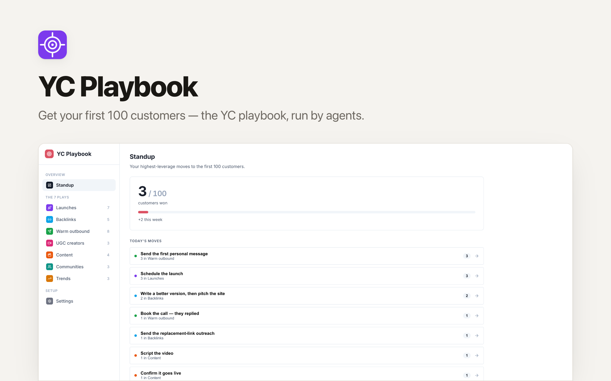

# YC Playbook

Get your first 100 customers with the **YC (Y Combinator) growth playbook**, run as a
go-to-market **war room** a team can actually execute — seven plays over one shared
pipeline, with a single weekly growth number on top. Built as a
[Clawnify](https://clawnify.com) template so agents do the grind and the founder keeps
the few high-judgment calls.

> YC's playbook to brute-force your way to 100 customers, almost no matter what your
> product is.

## The seven plays

| # | Play | What it is |
|---|------|-----------|
| 1 | **Launch-max** | Launch on every platform — 3× minimum. More launches = more eyeballs. |
| 2 | **Steal competitor backlinks** | Find where competitors get listed, make a better version, get listed (or replace). |
| 3 | **Warm outbound** | Scrape who engages with competitors, qualify against your ICP, message them personally. |
| 4 | **Hire UGC creators** | Source 20-30 creators, brief them, pay per video with performance incentives. |
| 5 | **Videos > everything** | Post product use-cases on X / LinkedIn. Video beats image/text 10×. |
| 6 | **Show up where customers are** | Find the Slack/Discord groups, newsletters, and podcasts your customers live in. |
| 7 | **Ride every relevant trend** | Jump on a fresh trend each week and fold your product in. |

Every play is the same shape — a list of items moving through a status pipeline — so
the whole app is one board component configured seven ways. The **Standup** view sits
on top: it shows the one number that matters (customers vs goal), surfaces today's
highest-leverage moves across all seven plays, and is where you log the weekly number.

## Stack

- **Frontend:** Preact + Vite (single-page board UI)
- **Backend:** Hono on Cloudflare Workers
- **Database:** D1 (SQLite), one table per play + `settings` + `weekly_metrics`
- **Data layer:** [`@clawnify/db`](https://www.npmjs.com/package/@clawnify/db)

## Develop

```bash
pnpm install
pnpm dev      # applies schema.sql to local D1, then runs vite + wrangler
```

- UI: http://localhost:5173
- API: http://localhost:8787

```bash
pnpm build      # vite build → dist/
pnpm typecheck  # tsc --noEmit
```

## Driving it with agents

The whole app is a clean JSON API (`/api/<play>`, `/api/standup`, `/api/stats`,
`/api/metrics`, `/api/settings`) so a Clawnify agent can run the plays end to end.
See [`AGENT.md`](./AGENT.md) for the operating guide, status pipelines, and the
semi-autonomous boundary (agents do the grind, the founder approves the personal and
paid moves).

## Project layout

```
src/
  shared/plays.ts          # the 7 plays defined once — drives server + client
  server/
    schema.sql             # D1 schema (7 play tables + settings + weekly_metrics)
    index.ts               # Hono API: generic per-play CRUD + standup/stats/metrics
    db.ts                  # @clawnify/db re-export
  client/
    app.tsx                # shell: sidebar + active view
    components/
      standup.tsx          # the number + today's moves + weekly logger
      play-board.tsx       # generic kanban, instantiated per play
      sidebar.tsx          # nav over Standup + 7 plays + Settings
      settings-panel.tsx   # product / ICP / competitors / goal
```
